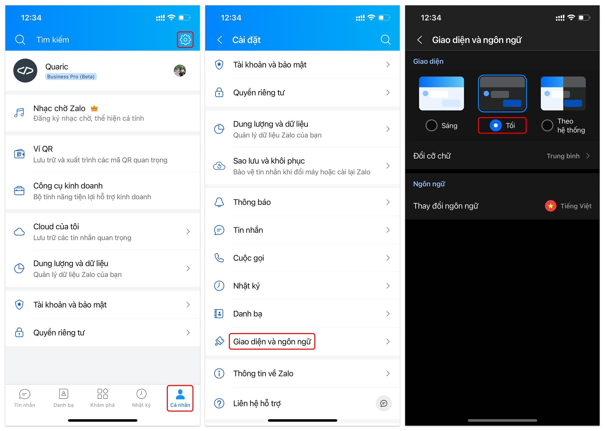

# Cài đặt ZaDark cho Zalo Mobile

Kích hoạt Dark Mode (Chế độ tối) cho Zalo Mobile trên iOS/Android.

:::tip
Dark Mode (Chế độ tối) cho Zalo Mobile trên iOS/Android đã có sẵn trong ứng dụng, vì vậy bạn không cần cài đặt thêm ZaDark. Bạn xem hình ảnh bên dưới để kích hoạt Dark Mode.
:::

